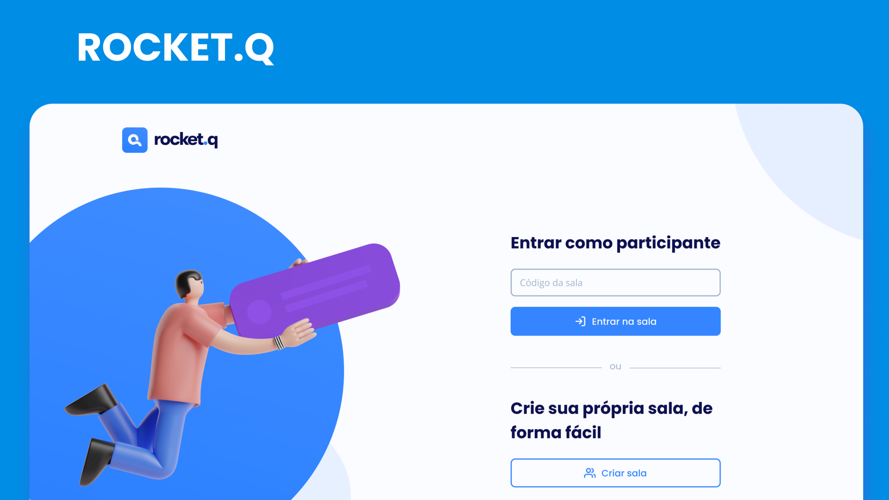

# 💻 Rocket.Q
Plataforma de perguntas em salas privadas com senha de acesso, o administrador da respectiva sala pode verificar as questões como lidas ou excluídas.

## Quais tecnologias foram utilizadas?
- HTML
- CSS
- JavaScript
- NodeJS
- EJS
- Express
- SQLite

# 🛠 Como Rodar o projeto localmente?
Faça o download do repositório e entre no repositório através do seu terminal
  1. Execute o comando <code>npm install</code> para instalar as dependências
  2. Depois, utilize o comando <code>npm run init-db</code> para instalar o banco de dados
  3. E para iniciar a aplicação, rode o comando <code>npm start</code>

# 📝 Licença
Este projeto foi desenvolvido para aprendizado de JavaScript e Node.js através da NLW#6 (Next Level Week) na Rocketseat.

Feito com amor, pelo Lealdev ♥
